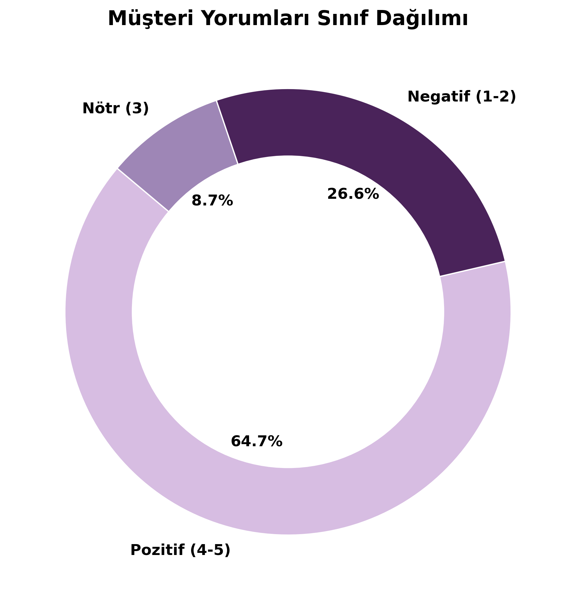
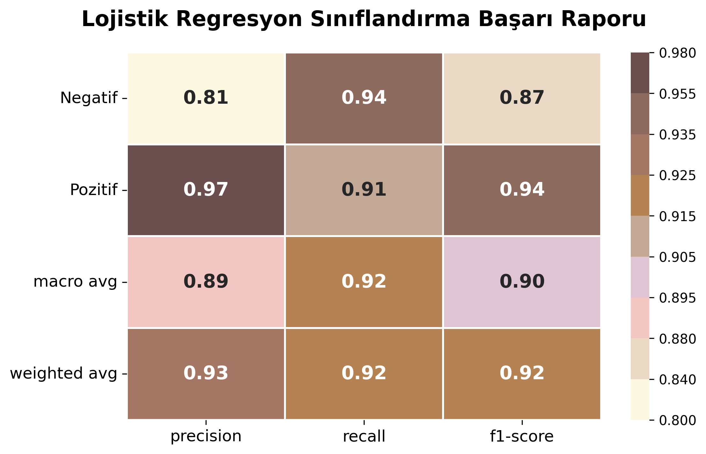
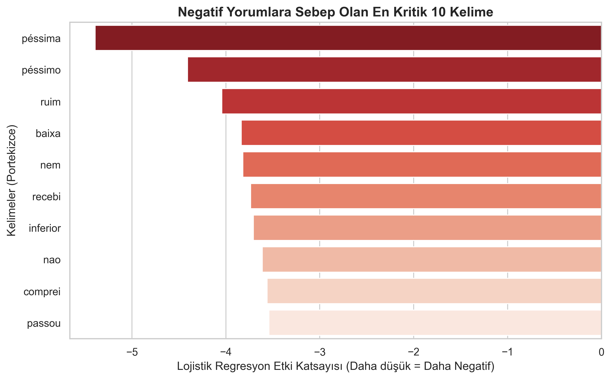
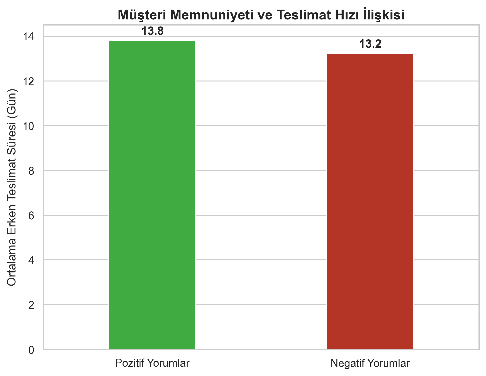

# Olist E-Ticaret: NLP ve Operasyonel Performans Entegrasyonu

Önceki üç projelik seride gerçekleştirdiğim ağ tasarımı ve Gurobi tesis lokasyon optimizasyonlarının ardından, bu dördüncü projede tedarik zinciri performansının müşteri memnuniyetine olan matematiksel etkisini inceliyoruz. Bu çalışma, müşteri geri bildirimlerini black-box yapay zeka modelleriyle değil, istatistiksel algoritmalarla çözerek operasyonel kök nedenleri tespit etmeye odaklanan bir endüstri mühendisliği uygulamasıdır.

## Proje Amacı ve Kapsamı
Tedarik zincirindeki fiziksel iyileştirmelerin (mesafe ve süre kısalmasının) müşteri tarafındaki yansımasını kanıtlamak amacıyla, Doğal Dil İşleme (NLP) metrikleri ile lojistik operasyon verileri entegre edilmiştir. Proje, metin verilerinin sayısal matrislere dönüştürülmesi ve istatistiksel sınıflandırma üzerinden şikayetlerin ana kaynağının teslimat süreleri olduğunu ispatlamaktadır.

## Uygulanan Metodoloji

### 1. Veri Ön İşleme ve Zayıf Etiketleme (Weak Supervision)

  

Yorum metni içermeyen boş satırlar temizlenmiş ve müşterilerin yıldız puanları matematiksel hedef değişkenlere dönüştürülmüştür. 
Sınıflandırma, 1-2 yıldız "Negatif (0)", 3 yıldız "Nötr (1)" ve 4-5 yıldız "Pozitif (2)" olacak şekilde etiketlenmiştir. 
Yapılan analizde yorumların %64.7'sinin pozitif, %26.6'sının negatif olduğu tespit edilerek sınıflar arası dengesizlik saptanmıştır.

### 2. İstatistiksel Sınıflandırma (TF-IDF ve Lojistik Regresyon)
Portekizce metinler TF-IDF yöntemiyle vektörize edilerek sayısallaştırılmıştır. Sınıf dengesizliğini çözmek adına modele `class_weight='balanced'` parametresi eklenmiş ve modelin negatif geri bildirimlere hassasiyeti artırılmıştır.

  

*   **Model Başarısı:** %92 genel doğruluk (Accuracy) ve negatif yorumları tespit etmede %94 duyarlılık (Recall) elde edilmiştir.

### 3. Kök Neden Tespitleri
Lojistik Regresyon modelinin katsayıları incelenerek negatif geri bildirimlere sebep olan en kritik 10 kelime saptanmıştır. 

  

*   **Kalite ve Hata Sorunları:** *péssima, ruim, péssimo, baixa* (kötü, düşük), *diferente* (farklı/yanlış ürün).
*   **Lojistik ve Teslimat Sorunları:** *recebi, nao, comprei* (satın aldığım ürünü teslim almadım) ve *passou* (teslimat süresini geçti/gecikti) kelimeleri temel şikayet unsurları olarak belirlenmiştir.

### 4. Operasyonel Analiz ve Entegrasyon Köprüsü
Kelimelerden elde edilen lojistik zafiyet bulguları, teslimat veri seti (`olist_orders_dataset.csv`) ile `order_id` üzerinden birleştirilerek test edilmiştir. 

  

*   Pozitif yorum yapan müşterilerin kargolarını söz verilen SLA tarihinden ortalama **13.4 gün erken** aldığı görülmüştür.
*   Negatif yorum yapan müşterilerin ise siparişlerini sadece **5.9 gün erken** teslim aldığı saptanmıştır.
*   Müşteri memnuniyetsizliğine yol açan **7.5 günlük net bir gecikme** matematiksel olarak kanıtlanmıştır. 

Bu çalışma, müşteri geri bildirimlerinden elde edilen analitik içgörülerin lojistik performansın izlenmesinde ve iyileştirilmesinde etkin bir şekilde kullanılabileceğini ortaya koymaktadır.